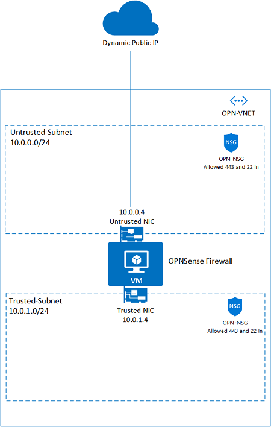

	# OPNsense Firewall on FreeBSD VM

** New VNET + OPNsense with two NICs **

** Existing VNET + OPNsense with two NICs (DR) **

by SecOps (from [wjwidener repo](https://github.com/wjwidener/fwdeployment)) which includes DoubleNAT issue and static IP assignment

** New VNET + OPNsense with two NICs **

<!-- **New VNET + OPNsense with single NIC**

**Existing VNET + OPNsense with single NIC**

-->

Those template allows you to deploy an OPNsense Firewall VM using the opnsense-bootsrtap installation method. It creates an FreeBSD VM, does a silent install of OPNsense using a modified version of opnsense-bootstrap.sh with the settings provided.

The login credentials are set during the installation process to:

- Username: root
- Password: 

After deployment, you can go to <https://PublicIP:8076>, then input the user and password, to configure the OPNsense firewall.

## Overview

This OPNsense solution is installed in FreeBSD 12.2 (Azure Image). 
Here is what you will see when you deploy this Template:

1) VNET with 4 Subnets and OPNsense VM with two NICs.
2) VNET Address space is: 10.xx.xx.0/16 (accordingly to the project subnet CIDR).
3) External NIC named nic1 Linked to firewall-frontend (10.xx.xx.0/27).
4) Internal NIC named nic2 Linked to firewall-backend (10.xx.xx.32/27).
5) It creates a NSG named Only-RFC-1918 which allows incoming and outgoing traffic to/from the 10.0.0.0/8, 172.16.0.0/12, 192.168.0.0/16. Same NSG is associated to the firewall-backend and management subnets.

## Design

Here is a visual representation of this design of the two NIC deployment:

## Deployment

Here are few considerations to deploy this solution correctly:

- When you deploy this template, it will leave only TCP 22 listening to Internet while OPNsense gets installed.
- To monitor the installation process during template deployment you can just probe the port 22 on OPNsense VM public IP (psping or tcping).
- When port is down which means OPNsense is installed and VM will get restarted automatically. At this point you will have only TCP 8076.

**Note**: It takes about 10 min to complete the whole process when VM is created and a new VM CustomScript is started to install OPNsense.

## Usage

- First access can be done using <HTTPS://PublicIP:8076.> Please ignore SSL/TLS errors and proceed.
- Your first login is going to be username "root" and password.

- **Note:** It is necessary to create appropriate Firewall rules inside OPNsense to desired traffic to work properly.

## Feedbacks

Please use Github [issues tab](https://github.com/oleksandrmeleshchuk-epm/Azure-OpnSense/issues) to provide feedback.
